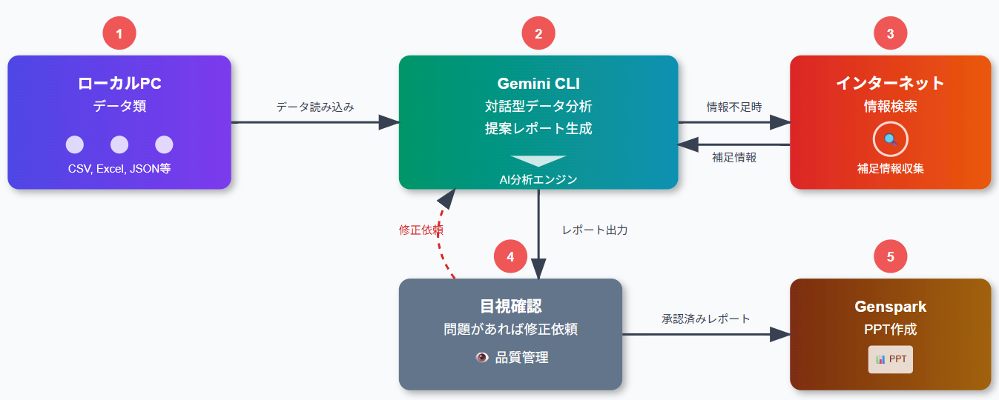

# 就職氷河期世代の分析とペルソナ生成ツール提案

[レポートはこちらで閲覧できます。](https://yasuhitoyanagisawa.github.io/2025-OpenDataHackathon-/2025%E9%83%BD%E7%9F%A5%E4%BA%8B%E6%9D%AFOpenDataHackathon%20%E4%B8%AD%E9%87%8E%E5%8C%BA%E8%A1%8C%E6%94%BF%E8%AA%B2%E9%A1%8C%E3%83%AC%E3%83%9D%E3%83%BC%E3%83%88.html)

[Genspark生成スライドはこちら。](./【2025ODH】Genspark生成スライド.pdf)

**組織名：** 中野区

2025年時点で30代後半から50代前半の就職氷河期世代は、低賃金、不安定な雇用、キャリアアップの困難さ、将来の生活への不安など多岐にわたる課題を抱えています。2045年以降、この世代が後期高齢者に差し掛かる中で、今後どのような施策が必要になるのかを検討するため、データに基づく対象者の実態把握が重要となります。本課題では、各種オープンデータを横断的に分析し、対象者のペルソナを生成するとともに、その特徴を活用した効果的な対応策の提案を募集します。

https://odhackathon.metro.tokyo.lg.jp/issues/

## データ分析システムアーキテクチャ図

システムの主要構成要素：

・ローカルPC（データ類） - CSV、Excel、JSON等の各種データファイルを保存

・Gemini CLI - 対話型でデータ分析を実行し、提案レポートを生成

・インターネット検索 - ローカル情報が不足している場合の補足情報収集

・目視確認・修正 - 生成されたレポートの品質管理と修正指示

・GenSpark - 承認済みレポートのPowerPoint変換

データフローの特徴：

・ローカルデータから始まる一方向の基本フロー

・情報不足時のインターネット検索による双方向補完

・品質管理のための修正フィードバックループ

・最終的なプレゼンテーション形式への変換

このシステムにより、データ分析から最終的なプレゼンテーション資料作成まで、AI技術を活用した効率的で高品質なワークフローが実現されます。
